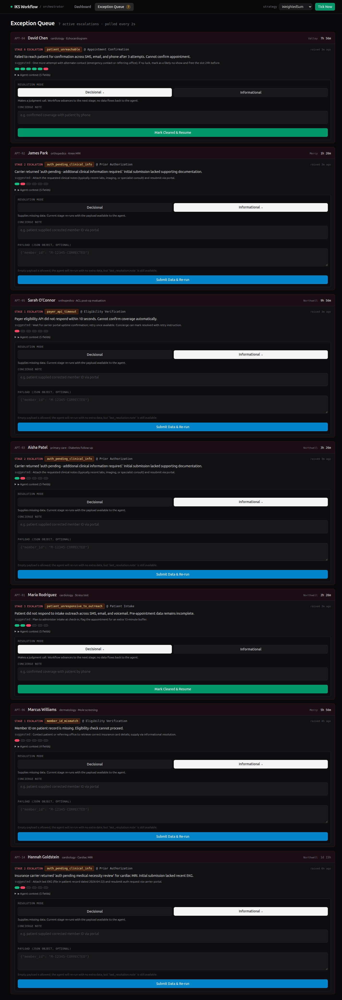
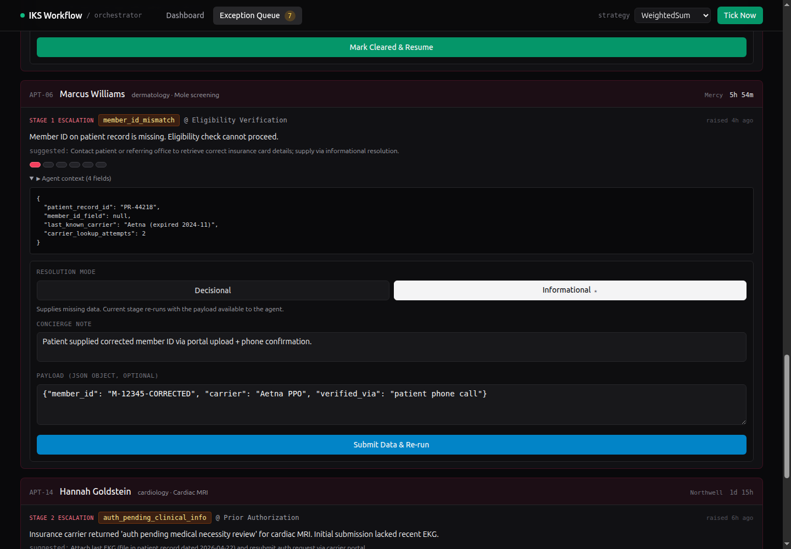
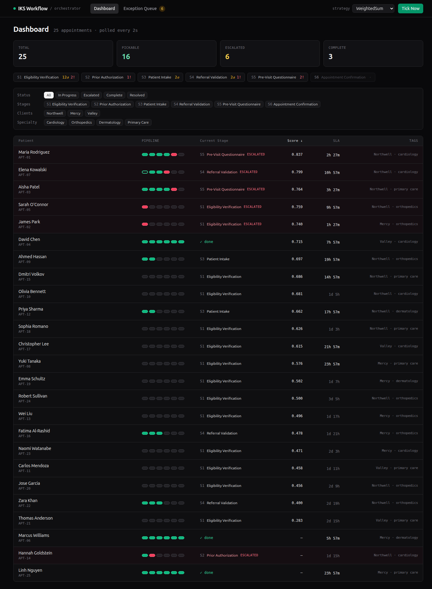

# Agentic Workflow Management System

A facade for a medical-appointment processing system. An orchestrator picks appointments by dynamic priority, runs each through six stage agents, and routes any escalation to a human concierge who resolves it back into the pipeline.

Built for an interview case study; the working demo is the deliverable, this README is the entry point. Architectural rationale lives in `decisions.md`; the build process and prompts that drove the most consequential decisions are in `process.md`.

## What it does

The orchestrator ingests a feed of 25 mocked appointments. Every tick (4 seconds, configurable) it scores all pickable appointments via a pluggable priority strategy, picks the highest, and advances it through the next stage in the pipeline. Each stage is an autonomous agent that may return `Complete` (advance), `Processing` (in progress), or `Escalate` (stop, hand to human). Escalations land in an Exception Queue with a structured payload; a human concierge resolves them, and the pipeline resumes.



## The six stages

| # | Stage | Responsibility |
|---|-------|----------------|
| 1 | Eligibility Verification | Confirm patient insurance is active and member ID matches |
| 2 | Prior Authorization | Submit and track auth requests with the carrier |
| 3 | Patient Intake | Collect demographics, contact info, consent forms |
| 4 | Referral Validation | Verify referral letter is on file, signed, in-scope |
| 5 | Pre-Visit Questionnaire | Patient symptom intake (the LLM-backed agent; deterministic mock by default) |
| 6 | Appointment Confirmation | Reach the patient, confirm slot, send instructions |

Stages 1-4 and 6 are mechanical near-clones; stage 5 wires an LLM seam (mock-default, real-Anthropic-with-prompt-caching when `MOCK_LLM=0`).

## Where agency lives (the four decision points)

This is the answer to "is it actually agentic?". Every appointment passes through four genuine decisions, not scripted flow:

1. **Agent escalation.** Each agent owns a per-stage *catalog* of plausible failure modes (`agents/_runtime.py` + per-agent `CATALOG`) and picks Complete vs. Escalate at runtime via weighted random over the catalog. The agent owns the verdict; the orchestrator owns the cursor.
2. **Orchestrator priority.** Every tick, the active strategy re-scores all pickable appointments. WeightedSum scores by SLA urgency, client weight, specialty weight, queue age. LLMRule (mock by default) returns a ranked list with natural-language reasoning. Re-scoring on every tick is what keeps "dynamic priorities" actually dynamic.
3. **Resume routing.** When the concierge resolves, the resolution carries a `resolution_type`. The orchestrator's exception node branches: decisional (advance to N+1, no data flows back to the agent) vs. informational (re-run stage N with `last_resolution.payload` available to the agent).
4. **Concierge mode override.** The Exception Queue's resolution form pre-selects from `EscalationReason.default_resolution_mode` (the catalog's hint). The human can override before submitting; their choice is what lands on `ConciergeResolution.resolution_type`.

## The three architectural ambiguities (and how each was resolved)

The brief was deliberately vague in three places. Each ambiguity got a deliberate decision with rationale logged in `decisions.md`:

1. **"Dynamic priorities, varying by client, specialty, or other unknown factors"** -> a pluggable Strategy pattern with a Protocol typing contract. WeightedSum (interpretable) and LLMRule (rules-driven, mock+real seam). Hot-swap at runtime via `POST /admin/strategy`. Same data, two lenses; the live swap is the demo's headline architectural moment.
2. **"Cleared" applies to what?** Stage-level, not appointment-level. An appointment with one cleared escalation and a downstream re-escalation is the realistic case (a 50% likely shape in our seed data). Treating Cleared as a stage state alongside `complete/processing/not_started/escalate` made the visual contract clean: a row of pills tells the per-stage story.
3. **"Resume workflow if necessary"** -> two resolution modes, not one. Decisional means the human's judgment supersedes (advance). Informational means the human supplies missing data (re-run). The catalog hints which is normal for each code; the human can override. This is a strict generalization of the original single-mode design and unlocks the most interesting demo moment: form a JSON payload, submit, watch the agent re-evaluate.

## Pluggable priority strategy

Two strategies live in `app/strategies.py`:

- **WeightedSumStrategy.** Named-constant weights (`SLA_URGENCY_WEIGHT=0.45`, `CLIENT_WEIGHT=0.20`, `SPECIALTY_WEIGHT=0.20`, `QUEUE_AGE_WEIGHT=0.15`; the asserted sum is 1.0). Returns a score and a reasoning string like `SLA 0.85, client 1.00, specialty 0.95, age 0.08 -> 0.799`.
- **LLMRuleStrategy.** Free-text rules input (e.g., "premium clients first; cardiac before dermatology; SLA inside 24h gets max boost"). Mock returns a canned `_LLMRanking` to keep the seam shape-consistent; real branch calls `AsyncAnthropic` with prompt caching. Defensive JSON parse with fallback. Reasoning string carries an `[llm_rule:mock]` prefix to make the lens visible.

Both strategies populate `priority_score` AND `priority_reasoning` on `AppointmentState`. Single wire shape, two interpretations. The frontend hover-on-score shows the reasoning text. Hot-swap via `POST /admin/strategy {"name": "weighted_sum" | "llm_rule"}`.

## The Exception Queue contract

The named UI/UX evaluation criterion. Every escalation carries a structured payload (`EscalationReason`):

```python
class EscalationReason:
    code: str                              # "member_id_mismatch", "auth_pending_clinical_info", ...
    message: str                           # human-readable
    suggested_action: str | None           # what the agent recommends
    agent_context: dict                    # whatever the agent saw, rendered as collapsible JSON
    raised_at: datetime
    raised_at_stage: StageName
    default_resolution_mode: ResolutionMode  # catalog hint: decisional | informational
```

The form uses `default_resolution_mode` to pre-select the toggle. Decisional sends `note` only; informational sends `note + payload` (any JSON object the agent should see on re-run). Submit -> `POST /exceptions/{id}/resolve`. The orchestrator resumes the LangGraph thread via `Command(resume=payload)`; the exception node branches by `resolution_type` and either advances the cursor (decisional, stage marked Cleared) or re-runs the stage (informational, stage reset to NotStarted, `last_resolution` populated for the agent to read).



After resolve, the dashboard's pipeline pills tell the lifecycle story. The pill for stage N flips to either:
- emerald **outline** (Cleared, human-resolved decisional), or
- amber-pulse -> emerald **solid** (informational re-run succeeded), or
- amber-pulse -> rose (informational re-run still failed; new escalation, possibly with different code).



## What was deliberately not built

| Out | Why |
|-----|-----|
| Real database | In-memory dict + LangGraph `InMemorySaver` checkpointer. Single-process demo. |
| Auth / per-user concierge identity | `resolver_id` defaults to `"concierge_demo"`. Production: authenticated user ID. |
| Real LLM in mechanical agents | Stage 5 has a real Anthropic seam (`MOCK_LLM=0`); other agents are deterministic mocks for demo reproducibility. |
| WebSocket / SSE | Polling at 2s. Production candidate for v2; current latency is 2s polling vs. 4s tick = always within one tick of truth. |
| Multi-user concurrency | Single asyncio lock on the store. Tick and resolve serialize. |
| Generated TypeScript types | `frontend/src/types.ts` is hand-mirrored from `backend/app/state.py`. The hand-edit IS the change-detection mechanism. |
| Audit / HIPAA controls | `resolutions[]` is append-only and timestamped. Real compliance work is out of scope. |
| Tests beyond smoke | Per-step `smoke_step{N}.py` scripts validated wire shape and lifecycle. No unit/integration suite. |
| Deployment / Docker / CI | Local-only demo. |
| Routing library | Two views, single `useState<ViewName>` for active view. |
| shadcn/ui | Plain Tailwind; the components in step 10/11 didn't need primitive abstractions. |

Each gap has a one-line v2 migration in `decisions.md`.

## Run it locally

Requires Python 3.11+ and Node 20+.

### Backend

```bash
cd backend
python3 -m venv .venv
.venv/bin/pip install -e .
IKS_TICK_INTERVAL_S=4 .venv/bin/uvicorn app.main:app --port 8765
```

Environment variables (all optional):
- `IKS_TICK_INTERVAL_S` (default 4): seconds between auto-ticks. Use 60 for slow demos; use 1 to fill the queue fast.
- `IKS_SEED`: deterministic random seed for reproducible demos.
- `MOCK_LLM` (default `1`): set to `0` to use real Anthropic for the Pre-Visit Questionnaire agent and LLMRule strategy. Requires `ANTHROPIC_API_KEY` env var.

### Frontend

```bash
cd frontend
npm install
npm run dev
```

Vite serves at `http://127.0.0.1:5173`. The frontend reads `VITE_API_BASE` (default `http://localhost:8765`).

### Demo controls

- `Tick Now` button: manually advance the orchestrator on cue.
- Strategy dropdown: live-swap WeightedSum vs LLMRule. Watch the priority lens shift.
- `POST /admin/seed`: reset to fresh state with 25 appointments + two pre-escalations (APT-06 informational, APT-14 informational).

## Map of the artifacts

```
.
├── README.md           this file (the entry point)
├── decisions.md        every architectural decision with options/chosen/rationale (the deep dive)
├── process.md          build process, release plan, and the prompts that drove key decisions
├── CLAUDE.md           the original brief + locked decisions (frozen contract)
├── backend/
│   ├── app/
│   │   ├── state.py            Pydantic domain model
│   │   ├── orchestrator.py     LangGraph StateGraph, exception node, routers
│   │   ├── store.py            in-memory store + lock + tick/resolve
│   │   ├── strategies.py       WeightedSum + LLMRule + Protocol contract
│   │   ├── main.py             FastAPI surface + lifespan tick loop
│   │   ├── mock_data.py        25 hand-tuned seed appointments
│   │   └── agents/             one file per stage + shared _runtime.py
│   ├── pyproject.toml
│   └── smoke_step*.py          per-step lifecycle smoke tests
└── frontend/
    └── src/
        ├── types.ts            hand-mirrored from state.py
        ├── api.ts              fetch wrapper
        ├── lib/                usePollingData (2s), useNow (1Hz)
        ├── components/         PipelinePills, SlaCountdown, StageBreakdown,
        │                       DashboardFilters, ResolutionForm, ExceptionCard,
        │                       TopNav, TickNowButton, StrategySwitcher
        └── views/
            ├── Dashboard.tsx       table + sortable columns + filter facets
            └── ExceptionQueue.tsx  cards + resolution form per card
```

## Demo narrative (5 minutes)

1. **Open Exception Queue.** 7 cards, mix of pre-escalations (APT-06, APT-14, both informational) and agent-rolled escalations. Each card shows code, stage, message, suggested action, agent context (collapsible), pipeline strip, resolution form. Mode toggle pre-selects from the catalog hint (the small ★).
2. **Resolve APT-06 informational.** Type a JSON payload like `{"member_id": "M-12345-CORRECTED"}`; submit. Card disappears. Switch to Dashboard. Watch the pipeline pills run: stage 1 amber-pulse, then green; stages 2-6 advance through.
3. **Resolve APT-14 decisional.** Just a note, click "Mark Cleared & Resume". Card disappears. Dashboard: APT-14's stage 2 pill is now an emerald outline (human-resolved), and stages 3-onward advance.
4. **Live strategy swap.** Top-nav strategy dropdown -> LLMRule. Reload the dashboard sort by Score. The reasoning prefix changes from `SLA 0.85, ...` to `[llm_rule:mock] ...`. Same data, different lens.
5. **What I would build next.** Three concrete v2 items: schema-aware payload form per code; SSE for sub-second escalation surfacing; pydantic2ts to remove the manual type mirror.
